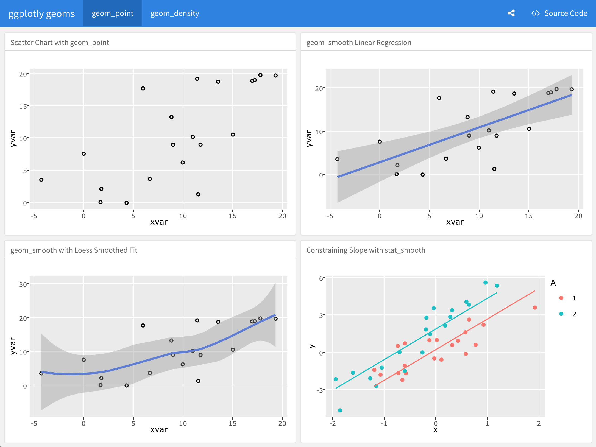
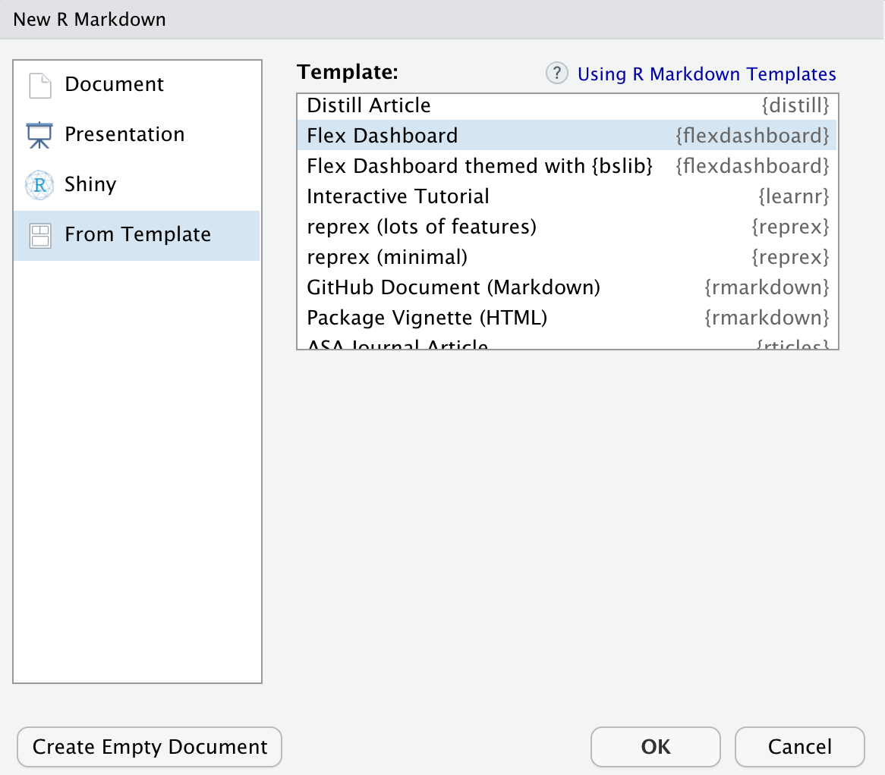

<script type="text/javascript">(function(w,s){var e=document.createElement("script");e.type="text/javascript";e.async=true;e.src="https://cdn.pagesense.io/js/webally/f2527eebee974243853bcd47b32631f4.js";var x=document.getElementsByTagName("script")[0];x.parentNode.insertBefore(e,x);})(window,"script");</script>

A package of R markdown templates and knitr knit engine replacements

These are a set of alternate R markdown templates that do not use Bootstrap and do not include or rely on jQuery. These are primarily here for demonstration purposes but are also useful in and of themselves (it's always good to have choices). If you have a particular framework you like and it's not here, file an issue and I'll add it.

- **bulma** (`output: markdowntemplates::bulma`) uses the [Bulma CSS framework](http://bulma.io) and has optional `navlink` YAML header elements and also has support for arbitrary footer content & a subset of OpenGraph tags (see the example Rmd) which will be used in header of the generated file.
- **skeleton** (`output: markdowntemplates::skeleton`) or **default** (`output: markdowntemplates::default`) uses the [Skeleton CSS framework](http://getskeleton.com) and has optional `navlink` YAML header elements and also has support for arbitrary footer content & a subset of OpenGraph tags (see the example Rmd) which will be used in header of the generated file.
- **kube** (`output: markdowntemplates::kube`) uses the [Kube CSS framework](https://imperavi.com/kube/) (contributed by Kieran Healy)
- **minimal** (`output: markdowntemplates::minimal`) uses no CSS framework and only uses the `title` YAML header element.
- **hugo** (`output: markdowntemplates::hugo`) produces markdown suitable for [Hugo](https://gohugo.io/) websites. It makes a broad assumption that you will save/use the `hugo` document in the `content` directory of your Hugo websites. 
- **prismpress** (`output: markdowntemplates::prismpress`) produces markdown suitable for use in WordPress with Jetpack (markdown-enabled) and Prism
- **prismskel** (`output: markdowntemplates::hrbrskel`) is a revamp of
the `skeleton` template that has top navbar and footer as optional, uses different
base colors, is Fira Sans/Fira Code-based and uses Prism for code highlighting
with a dark theme.

When you use RStudio to create a new R Markdown document, select "From Template" and choose one of these templates.

### knit engine replacements

- `to_jupyter()` : uses `notedown` to make an `ipynb` out of an Rmd
If you create an R markdown (Rmd) document with the following YAML header:

    ---
    knit: markdowntemplates::to_jupyter
    run: false
    ---The `to_jupyter()` engine will be used and [`notedown`](https://github.com/aaren/notedown) will be used to convert the notebook to a Jupyter (ipynb) notebook. The `run` parameter is optional. If not present or set to `true` the notebook will be executed as it is converted to a Jupyter notebook. The engine is also now smart enough to detect the absence of pure R code chunks and avoid including of:

    %load_ext rpy2.ipython
    
at the top of the notebook.

### Installation

Since the package is not on CRAN yet, you have to install it devtools-style

```
devtools::install_git("https://sr.ht/~hrbrmstr/markdowntemplates")
# OR
devtools::install_git("https://gitlab.com/hrbrmstr/markdowntemplates")
# OR
devtools::install_github("hrbrmstr/markdowntemplates")
```

### NBA Scoring


### GGPlotly Geo



### Gene Expression Bi-Clustering


### R-Markdown

