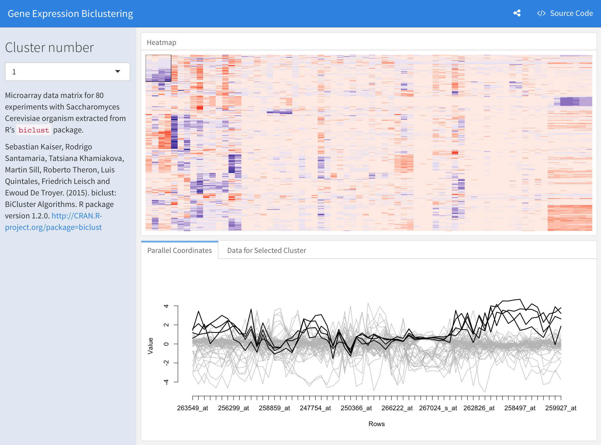

<script type="text/javascript">(function(w,s){var e=document.createElement("script");e.type="text/javascript";e.async=true;e.src="https://cdn.pagesense.io/js/webally/f2527eebee974243853bcd47b32631f4.js";var x=document.getElementsByTagName("script")[0];x.parentNode.insertBefore(e,x);})(window,"script");</script>

R Markdown documents are fully reproducible. Use a productive [notebook interface](https://bookdown.org/yihui/rmarkdown/notebook.html) to weave together narrative text and code to produce elegantly formatted output. Use multiple languages including R, Python, and SQL.

R Markdown supports dozens of static and dynamic output formats including 
- [HTML](https://bookdown.org/yihui/rmarkdown/html-document.html) 
- [PDF](https://bookdown.org/yihui/rmarkdown/pdf-document.html) 
- [MS Word](https://bookdown.org/yihui/rmarkdown/word-document.html)
- [Beamer](https://bookdown.org/yihui/rmarkdown/beamer-presentation.html) 
- [HTML5 slides](https://bookdown.org/yihui/rmarkdown/ioslides-presentation.html), 
- [Tufte-style handouts](https://bookdown.org/yihui/rmarkdown/tufte-handouts.html) 
- [books](https://bookdown.org),
- [dashboards](https://rmarkdown.rstudio.com/flexdashboard/),
- [shiny applications](https://bookdown.org/yihui/rmarkdown/shiny-documents.html), 
- [scientific articles](https://github.com/rstudio/rticles)>, 
- [websites](https://bookdown.org/yihui/rmarkdown/rmarkdown-site.html) and more


## Full R Markdown Docs

[https://rmarkdown.rstudio.com](https://rmarkdown.rstudio.com)

## Some More Interesting Links

- **[R Cheat Sheet](mdCheatsheet.pdf)**
- [Reusable Version in rCharts](http://timelyportfolio.github.io/rCharts_nyt_home_price)
- [Pandoc Artcle Example](https://github.com/svmiller/svm-r-markdown-templates/blob/master/article-example/svm-rmarkdown-article-example.pdf)
  - [Or as PDF](examples/md-article-example.pdf) 
  - [Another R Markdown Example](examples/md-example.pdf)
- [A Tufte Handout Example](https://rstudio.github.io/tufte)
- [Leaflet Layers Example](https://rpubs.com/jcheng/leaflet-layers-example)
- [Cran Gauge Example](https://gallery.shinyapps.io/cran-gauge/)
  - [Comprehensive R Archive Network for rstudio.com](http://cran.rstudio.com)


||| Interactive 

!!!
[Examples Click to Open](https://beta.rstudioconnect.com/jjallaire/htmlwidgets-highcharter/htmlwidgets-highcharter.html#sales-by-category)
!!!


||| Sales Reports

!!!
[Widgets Click to Open](https://beta.rstudioconnect.com/jjallaire/htmlwidgets-showcase-storyboard/htmlwidgets-showcase-storyboard.html)
!!!


|||


### Dashboards

- [Daily Operation Dashboard](https://rpubs.com/sdplus/vulcan74)

### Authoring Books and Technical Documents with R Markdown

- [https://bookdown.org/yihui/bookdown/](https://bookdown.org/yihui/bookdown/)

### R for Data Science

- [https://r4ds.had.co.nz/](https://r4ds.had.co.nz/)


## All the above and more **R Markkown**

[ttps://rmarkdown.rstudio.com]https://rmarkdown.rstudio.com/)

**anlyze. Share. Reproduce.**

- Your data tells a story. Tell it with R Markdown. Turn your analyses into high quality documents, reports, presentations and dashboards.

## flexdashboard 

The goal of flexdashboard is to make it easy to create interactive dashboards for R, using R Markdown.

- Use [R Markdown](https://rmarkdown.rstudio.com/) to publish a group of related data visualizations as a dashboard.
- Support for a wide variety of components including [htmlwidgets](https://www.htmlwidgets.org/); base, lattice, and grid graphics; tabular data; gauges and value boxes; and text annotations.
- Flexible and easy to specify row and column-based [layouts](https://pkgs.rstudio.com/flexdashboard/articles/layouts.html). Components are intelligently re-sized to fill the browser and adapted for display on mobile devices.
- [Storyboard](https://pkgs.rstudio.com/flexdashboard/articles/using.html#storyboards-1) layouts for presenting sequences of visualizations and related commentary.
- Optionally use [Shiny](https://shiny.rstudio.com/) to drive visualizations dynamically.
- Optionally use [bslib](https://rstudio.github.io/bslib/) to easily [customize main colors, fonts, and more.](https://pkgs.rstudio.com/flexdashboard/articles/theme.htmls)
- Learn more about **flexdashboard:** [https://pkgs.rstudio.com/flexdashboard](https://pkgs.rstudio.com/flexdashboard)

Examples:

|||

|||

|||

|||

View more examples [here](Mhttps://pkgs.rstudio.com/flexdashboard/articles/examples.html).

## Installation

Install the flexdashboard package from CRAN as follows:

```R
install.packages("flexdashboard")
```

If you want to use the development version of the flexdashboard package, you can install the package from GitHub via the remotes package:

```R
remotes::install_github('rstudio/flexdashboard')
```

## Usage

To author a flexdashboard you create an R Markdown document with the 
[flexdashboard::flex_dashboard](https://pkgs.rstudio.com/flexdashboard/reference/flex_dashboard.html) output format. You can do this from within RStudio using the **New R Markdown** dialog:


If you are not using RStudio, you can create a new flexdashboard R Markdown file from the R console. Currently there are two templates:

- "flex_dashboard" (basic) and

- "flex_dashboard_bslib" (an example of theming with {bslib}):

```R
rmarkdown::draft("dashboard.Rmd",
                 template = "flex_dashboard_bslib",
                 package = "flexdashboard")
```