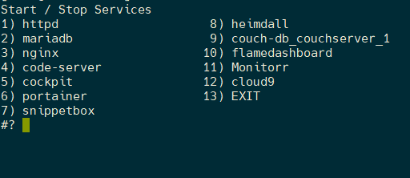

# Bash Scripts: Service menu

> Stopping and starting services and docker containers can be a pain, so i created a script to make it less irritating and boring to do.

## Use the service-menu (sm)

```shell
# I added the folder where I saved all my scripts to the PATH
# So just enter the following:
service-menu or sm
```

Something that looks like this or something close to this will be displayed



## Update 2022-02-02

I Updated the service menu with the `-r` flag and the `-s` flag

### Usage `-r` Flag

```sh
sm -r

### This will run the same menu but instead of the the service wither stopping or starting depending on it's status, -r will send a restart command to any of the servies or containes chosen
```

### Usage `-s` Flag

```sh
sm -s

### This will run the same menu but instead of the the service wither stopping or starting depending on it's status, -s will send a status / inspect command to any of the servies or containes chosen
```
